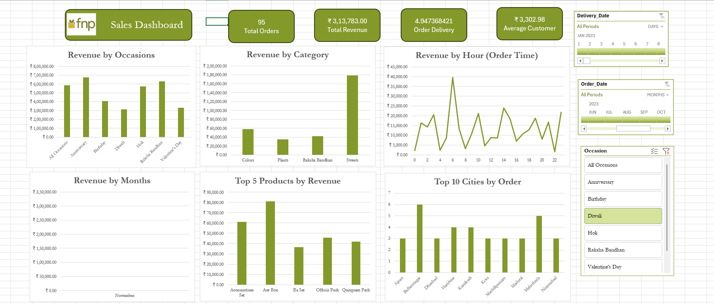

# FNP Data Dashboard Breakdown 📊

## 📌 Project Overview
The **FNP Data Dashboard** is a comprehensive analytics tool tailored for analyzing sales performance in the gifting industry. Built entirely in **Microsoft Excel**, this interactive dashboard provides granular visibility into order trends, revenue streams, and customer purchasing behaviors.

It serves as a strategic asset for stakeholders to monitor KPIs, understand demand fluctuations across different occasions, and identify high-value opportunities in real-time.

---

## 🚀 Key Features

### 1. **Executive KPI Tracking**
- **Total Orders & Revenue**: Instant view of the business's bottom line.
- **Average Customer Value (ACV)**: Gauge spending power per transaction.
- **Service Efficiency**: Monitor average order delivery times.

### 2. **Multi-Dimensional Analysis**
- **Occasion-Based Insights**: Compare performance across major events (e.g., *Diwali, Valentine’s Day, Anniversaries*).
- **Category Deep-Dives**: Analyze revenue splits among **Flowers, Cakes, Plants, and Gift Packs**.
- **Geographic Hotspots**: Identify top-performing cities driving the most volume.

### 3. **Temporal Trends**
- **Hourly Rush Analysis**: Pinpoint peak ordering hours to optimize logistics and staffing.
- **Monthly Revenue Trajectory**: Visualize growth patterns and seasonal successes.

### 4. **Dynamic User Experience**
- **Interactive Slicers**: Filter the entire report by **Month, Delivery Date,** or **Occasion** with a single click.
- **Top 5 / Top 10 Lists**: Instantly rank products and locations.

---

## 🛠️ Technical Implementation
This project leverages advanced Excel capabilities to transform raw data into actionable intelligence:

- **Data Processing**: Cleaned and structured raw datasets for accurate reporting.
- **Pivot Tables & Charts**: Aggregated millions of data points into meaningful summaries.
- **Slicers & Timelines**: implemented for seamless, user-friendly navigation.
- **Conditional Formatting**: Used to highlight trends and outliers visually.
- **Dashboard Design**: Applied professional UI principles for a clean, readable layout.

---

## 📂 Project Structure
- `FNP_DASHBOARD.xlsx` - The main interactive dashboard file.
- `FNP_DASHBOARD_IMAGE.png` - Preview image of the dashboard.
- `README.md` - Project documentation.

## 💡 How to Use
1. **Open** the `FNP_DASHBOARD.xlsx` file.
2. **Navigate** to the "Dashboard" sheet.
3. **Use the Slicers** on the left/top to filter by specific months or occasions (e.g., select "December" to see end-of-year performance).
4. **Hover** over charts to see specific data point values.

---

*Analysis performed and dashboard designed by Ragul-AP.*